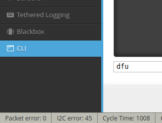
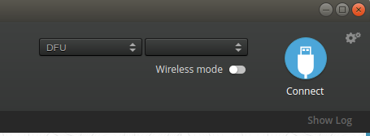
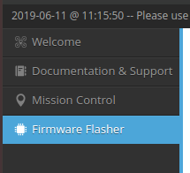
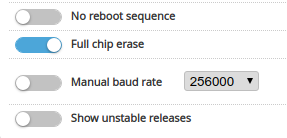
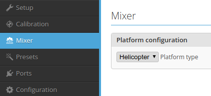
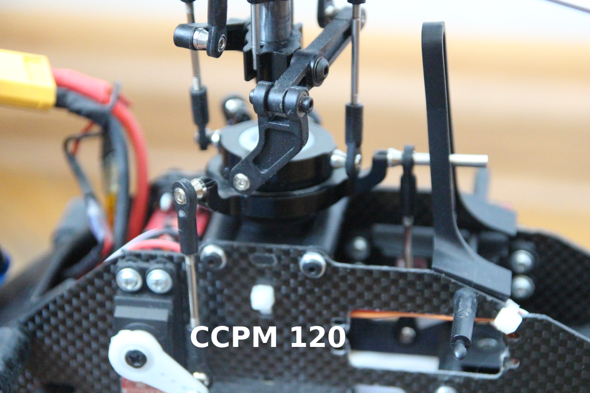
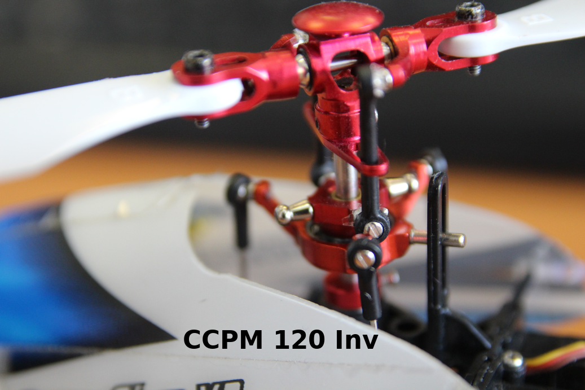
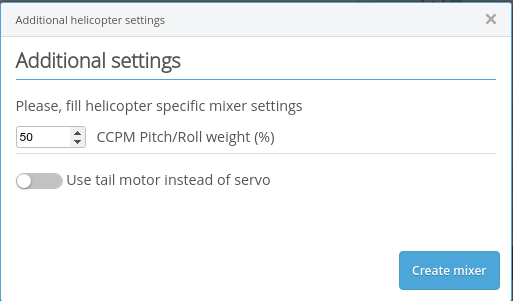

# Traditional helicopter setup

## Disclaimer
We ported INAV on traditional helicopter for ourselves. Use it on your own risk! RC helicopter may be very dangerous. We suppose you know what you do. We mean that you are able to build, to configure and to fly RC helicopter without INAV or any other simillar products. According to laws of many countries RC model with autopilot may be consider as UAV. You are responsible of following your local laws.

## Links
If you are new to INAV, please read [Getting started](Getting%20Started.md).

Please read [safety guide](Safety.md) before turning on RC model.

Also we recomend you to read about [the board you own](Boards.md).
Please make sure that your board supports as much [motors and servos](ESC%20and%20servo%20outputs.md) as you've got on your helicopter.

## Flashing INAV
**WARNING!** Disconect all ESC's and servos from board or disconect separate power if possible before flashing!

Traditional helicopter supported by INAV started [firmware](https://github.com/iNavFlight/inav/releases) version 2.3.0.
1. Download [INAV configurator](https://github.com/iNavFlight/inav-configurator) for your OS.
2. Switch your board to DFU mode (board usualy has got a button for it or if there is already INAV, CleanFlight or BetaFlight on your board make CLI command "dfu")

3. Run INAV configurator (under Linux you may need root previlege). You should see in dropdown list "DFU".

4. Open "Firmware Flasher" tab.

5. Chose your board and firmware version.

6. Push "Load Fiemware [Online]" button. After download is complete check "Full chip erase" and push "Flash Firmware" button.

## Basic mixer setup
**WARNING!** Disconect all ESC's and servos from board or disconect separate power if possible before setup!

1. Chose correct serial port and push "Connect" button.

2. Go to "Mixer" tab and in "Platform configuration" dropdown list choose "Helicopter".

3. At the time of writing this document there is one configuration of CCPM is suported (CCPM 120). Choose corresponding CCPM configuration. If pitch servo on your helicopter is behind swashplate then choose "CCPM 120" mixer preset. If pitch servo on your helicopter is in fornt of swashplate then choose "CCPM 120 Inv" mixer preset (see pictures below). Push "Load mixer" button.

4. Select CCPM Pitch/Roll weight (50% is good start value, you will select more accurate value later). This value represents the relation between servo move for cyclic pitch and servo move for collective pitch (If you want to know more about this value read [this pull request](https://github.com/iNavFlight/inav/pull/4701)). If your helicopter has got a tail motor instead of tail rotor blades pitch control then check corresponding checkbox. Push "Create mixer" button.

5. Push "Save and Reboot" button.

6. Use PWM generator to determine min and max servo positions. For CCPM servos positions determined by swashplate ability to move along the shaft.
